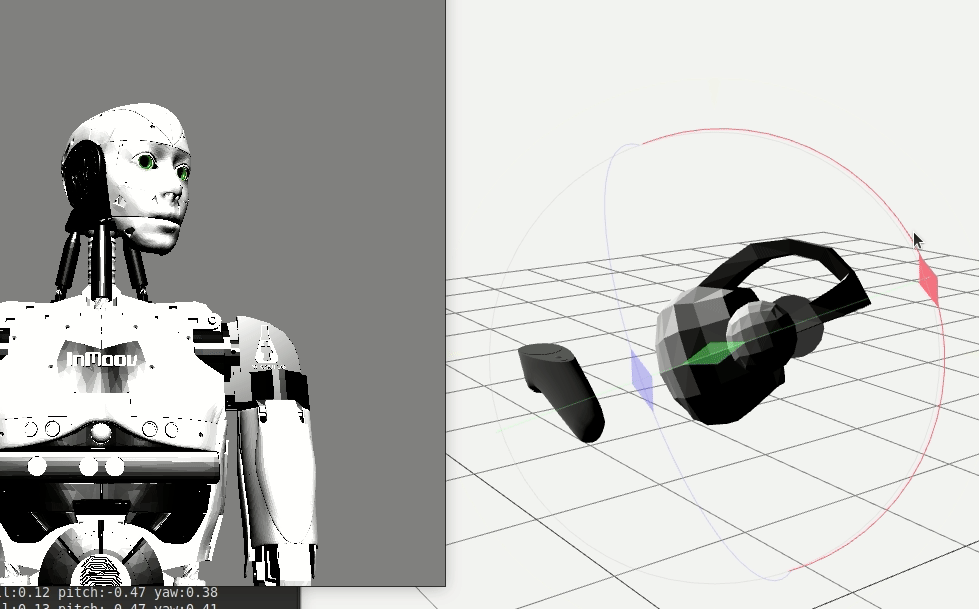

myrobotlab
==========

## MyRobotLab Nixie Release

Open Source Framework for Robotics and Creative Machine Control
  *You know, for robots!*

* Project Website http://myrobotlab.org 
* Project Discord https://discord.gg/AfScp5x8r5
* Latest Build    [Nixie 1.1.(Latest)](http://build.myrobotlab.org:8080/job/myrobotlab/job/develop/lastSuccessfulBuild/artifact/target/myrobotlab.zip)
* Latest Javadocs [Javdocs](http://build.myrobotlab.org:8080/job/myrobotlab/job/develop/lastSuccessfulBuild/artifact/target/site/apidocs/org/myrobotlab/service/package-summary.html)

## Base Requirements

You will need Java 11 or newer.  If you are only running MyRobotLab you need the JRE (Java Runtime Environment.)  If you are going to be building from source, you'll need the JDK (Java Development Kit) Oracle or OpenJDK will work

## Download the myrobotlab.jar
Download

latest [Nixie 1.1.X](http://build.myrobotlab.org:8080/job/myrobotlab/job/develop/lastSuccessfulBuild/artifact/target/myrobotlab.zip)

stable [Manticore 1.0.2693](https://github.com/MyRobotLab/myrobotlab/releases/tag/1.0.2693)

## Running MyRobotLab

After downloading and unzipping myrobtlab.zip into a new folder, start the appropriate script 
### Linux or MacOS
`myrobotlab.sh`
### Windows
`myrobotlab.bat`

The first time the script runs it will automatically install all services and their dependencies, then it will launch myrobotlab.
The subsequent starting of myrobotlab will skip the installation stage.  If a browser does not automatically start you
can go to http://localhost:8888 to see the web user interface.

## Building Project
MyRobotLab core is written in Java, it is a maven project - Any IDE which can load maven should work.  Its web ui is written in AngularJs and html.  
A few services (e.g. InMoov2 & ProgramAB) are in a different repo.  The can be developed seperately so 3 build instruction sets are described.

All development environments require git and cloning the source.

#### Cloning Repo

create a directory to clone the repositories in  (assuming you're on windows and cloning to the c:\dev directory)

```dos
mkdir c:\dev
cd dev
git clone https://github.com/MyRobotLab/myrobotlab.git
cd c:\dev\myrobotlab
```

### Java Core
If you want to be making core changes, you will need to install a 
Java developement environment

#### Install Java 11
https://www.oracle.com/java/technologies/downloads/#java11

### Building with Eclipse
Download Eclipse for Java Developers At:
https://www.eclipse.org/downloads/packages/


### Building with Maven

MyRobotLab builds using the Apache Maven java build system.

Download Maven At:
https://maven.apache.org/download.cgi
 
To compile and build a myrobotlab.jar  first : ensure that "mvn" (maven version 3.3+ is installed and in the path)

`mvn clean install`  

This should produce a local build for you "myrobotlab.jar" file will be located at

myrobotlab/target/myrobotlab.jar   

If you want to compile and skip the tests, you can use the standard maven approach 

`mvn clean install -DskipTests`

## Web UI Style Guide
* [Title Caps for field names and elements](https://learn.microsoft.com/en-us/previous-versions/windows/desktop/bb246428(v=vs.85)?redirectedfrom=MSDN)
* [No semi-colons for field names if labels exist](https://ux.stackexchange.com/questions/3611/should-label-and-field-be-separated-with-colon)

## Contributing

All development is done on the `develop` branch.  To contribute code, the typical approach is to create an issue about the feature/bug you're working on.

From Github create a branch based off the "develop" branch with a descriptive name  (and associated Issue number if available)
Locally switch to the new branch 
Make code changes
Commit & Push (frequently!)
When code is ready, submit a pull request to the develop branch!
Enjoy the code review, address issues and concern in the code review
Reviewer merges pull request to develop.
Reviewer deletes branch.

The following config should be useful to work directly on WebGui UI and
InMoov2 UI if the repos are submoduled under 
src/main/resources/resource/InMoov2,
src/main/resources/resource/ProgramAB
```yml
!!org.myrobotlab.service.config.WebGuiConfig
autoStartBrowser: false
enableMdns: false
listeners: null
peers: null
port: 8888
resources:
  # these are the only two in usual runtime
  # - ./resource/WebGui/app
  # - ./resource
  # the rest are useful when doing dev
- ./src/main/resources/resource/WebGui/app
- ./src/main/resources/resource/InMoov2/peers/WebGui/app
- ./src/main/resources/resource
type: WebGui
```
```yml
!!org.myrobotlab.service.config.RuntimeConfig
enableCli: true
id: null
listeners:
locale: null
logLevel: info
peers: null
registry:
- runtime
- security
- webgui
- python
resource: ./src/main/resources/resource
type: Runtime
virtual: false
```

# Network Distributed Architecture

## Websockets - Default Response for New Connection

```mermaid
sequenceDiagram
    autonumber
    box Process Id p1
    participant runtime@p1   
    end

    box Process Id p2
    participant webgui@p2
    participant runtime@p2
    end

    Note right of runtime@p1: Client runtime@p1 opens a <br/>websocket to remote webgui

    runtime@p1->>webgui@p2: Connect<br/>ws://localhost:8888/api/messages?user=root&pwd=pwd&session_id=2309adf3dlkdk&id=p1

    Note left of webgui@p2: Remote webgui@p2 and runtime@p2 attempt to subscribe <br/> to the describe method of the runtime@p1
    webgui@p2->>runtime@p1: addListener describe
    Note left of webgui@p2: runtime@p2 sends a describe request to runtime@p1
    webgui@p2->>runtime@p1: describe 
    Note right of runtime@p1: runtime@p1 responds with a describe response
    runtime@p1->>webgui@p2: onDescribe 
    Note left of webgui@p2: Based on the results of the describe,<br/> more querying and subscriptions can be processed


    %% opt Server Add Listener, Describe and Reserve
    %% end


```


### Minimal Message API Definition

```json
{
  "name": "runtime",
  "method": "connect",
  "data": [
    "\"http://main.myrobotlab.org:8888\""
  ],
}

```

### Path API Definition
```
/{service-name}/{method-name}/{json-param1}/{json-param2}/{json-param3}...
```
The Path API definition is a simple way to define a RESTful API.  The path is parsed and the service name, method name, and parameters are extracted.  The parameters are json encoded and converted to the correct type when the method is invoked.  The response is returned as a JSON object. The REST and CLI both use this API definition.

#### Examples
```
http://localhost:8888/runtime/getUptime
http://localhost:8888/runtime/connect/"http://main.myrobotlab.org:8888"
http://localhost:8888/arduino/connect/"COM3"
```
The exact same paths can be used in the CLI
```
/runtime/getUptime
/runtime/connect/"http://main.myrobotlab.org:8888"
/arduino/connect/"COM3"
```


### 1 Connection
A connection with a websocket starts with an HTTP GET 
```
ws://localhost:8888/api/messages?user=root&pwd=pwd&session_id=2309adf3dlkdk&id=p1
```
### 2 Subscribe to Runtime Describe
When a connection is established between two different myrobotlab instances p1 and p2,
the following messages are sent.  The first message is adding a subscription to the runtime of the
other process.  The subscription is for the function "describe".  The second message will be a describe request.
```json
{
  "msgId": 1690145377501,
  "name": "runtime",
  "sender": "webgui@p2",
  "sendingMethod": "",
  "historyList": [],
  "properties": null,
  "status": null,
  "encoding": "json",
  "method": "addListener",
  "data": [
    "{\"topicMethod\":\"describe\",\"callbackName\":\"runtime@caring-hector\",\"callbackMethod\":\"onDescribe\",\"class\":\"org.myrobotlab.framework.MRLListener\"}"
  ],
  "class": "org.myrobotlab.framework.Message"
}
```
### 3 Send Describe

```json
{
  "msgId": 1690145377501,
  "name": "runtime",
  "sender": "webgui@p2",
  "sendingMethod": "",
  "historyList": [],
  "properties": null,
  "status": null,
  "encoding": "json",
  "method": "describe",
  "data": [
    "\"fill-uuid\"",
    "{\"id\":\"caring-hector\",\"uuid\":\"383b4070-2848-4c3d-85f4-e7f6e081d18e\",\"platform\":{\"os\":\"linux\",\"arch\":\"x86\",\"osBitness\":64,\"jvmBitness\":64,\"lang\":\"java\",\"vmName\":\"OpenJDK 64-Bit Server VM\",\"vmVersion\":\"11\",\"mrlVersion\":\"unknownVersion\",\"isVirtual\":false,\"id\":\"caring-hector\",\"branch\":\"develop\",\"pid\":\"1500044\",\"hostname\":\"t14-gperry\",\"commit\":\"55d0163663825dd0aaa10568bc01e035c7f21532\",\"build\":null,\"motd\":\"resistance is futile, we have cookies and robots ...\",\"startTime\":1690135873670,\"manifest\":{\"git.branch\":\"develop\",\"git.build.host\":\"t14-gperry\",\"git.build.time\":\"2023-07-23T10:38:46-0700\",\"git.build.user.email\":\"grog@myrobotlab.org\",\"git.build.user.name\":\"grog\",\"git.build.version\":\"0.0.1-SNAPSHOT\",\"git.closest.tag.commit.count\":\"13447\",\"git.closest.tag.name\":\"1.0.119\",\"git.commit.author.time\":\"2023-07-22T20:15:51-0700\",\"git.commit.committer.time\":\"2023-07-22T20:15:51-0700\",\"git.commit.id\":\"55d0163663825dd0aaa10568bc01e035c7f21532\",\"git.commit.id.abbrev\":\"55d0163\",\"git.commit.id.describe\":\"1.0.119-13447-g55d0163\",\"git.commit.id.describe-short\":\"1.0.119-13447\",\"git.commit.message.full\":\"Cron enhanced 2 (#1318)\\n\\n* Improved Cron and Cron history\\r\\n\\r\\n* forgot one\\r\\n\\r\\n* Teamwork fix of Hd44780\\r\\n\\r\\n* updated from review\",\"git.commit.message.short\":\"Cron enhanced 2 (#1318)\",\"git.commit.time\":\"2023-07-22T20:15:51-0700\",\"git.commit.user.email\":\"grog@myrobotlab.org\",\"git.commit.user.name\":\"GroG\",\"git.dirty\":\"false\",\"git.local.branch.ahead\":\"0\",\"git.local.branch.behind\":\"0\",\"git.remote.origin.url\":\"git@github.com-myrobotlab:MyRobotLab/myrobotlab.git\",\"git.tags\":\"1.1.1194\",\"git.total.commit.count\":\"14104\"},\"shortCommit\":\"55d0163\",\"class\":\"org.myrobotlab.framework.Platform\"},\"class\":\"org.myrobotlab.framework.DescribeQuery\"}"
  ],
  "class": "org.myrobotlab.framework.Message"
}

```

The describe message sends instance and platform information in return, the return data from describe, will return with an onDescribe message that contains all the service information from the remote (p2) process

### 4 Process onDescribe Response
```json
{
   "msgId":1692478237121,
   "name":"runtime@webgui-client",
   "sender":"runtime@unhealthy-giddy",
   "sendingMethod":"describe",
   "historyList":[
      "unhealthy-giddy"
   ],
   "properties":null,
   "status":null,
   "encoding":"json",
   "method":"onDescribe",
   "data":[
      "{\"id\":\"unhealthy-giddy\",\"uuid\":null,\"request\":null,\"platform\":{\"os\":\"linux\",\"arch\":\"x86\",\"osBitness\":64,\"jvmBitness\":64,\"lang\":\"java\",\"vmName\":\"OpenJDK 64-Bit Server VM\",\"vmVersion\":\"11\",\"mrlVersion\":\"unknownVersion\",\"isVirtual\":false,\"id\":\"unhealthy-giddy\",\"branch\":\"grog\",\"pid\":\"2462761\",\"hostname\":\"t14-gperry\",\"commit\":\"5610a6602bef704a84160d7d067af3b417be1998\",\"build\":null,\"motd\":\"resistance is futile, we have cookies and robots ...\",\"startTime\":1692478154179,\"manifest\":{\"git.branch\":\"grog\",\"git.build.host\":\"t14-gperry\",\"git.build.time\":\"2023-08-19T09:36:36-0700\",\"git.build.user.email\":\"grog@myrobotlab.org\",\"git.build.user.name\":\"grog\",\"git.build.version\":\"0.0.1-SNAPSHOT\",\"git.closest.tag.commit.count\":\"13778\",\"git.closest.tag.name\":\"1.0.119\",\"git.commit.author.time\":\"2023-08-19T09:21:48-0700\",\"git.commit.committer.time\":\"2023-08-19T09:21:48-0700\",\"git.commit.\"class\":\"org.myrobotlab.framework.DescribeResults\"} ....   WAY WAY TOO MUCH DATA !!!!  ..."
   ],
   "class":"org.myrobotlab.framework.Message"
}
```

The response back will include serialized services which should be refactor to be more minimal, and more describe parameters which can return interfaces or methods
Services returned from the Describe request have been registered.  By default they are only the currently "local" registered services.  

The response should be refactored so that the material returned is related to criterial requested. 
For example, if only a list of services and their names are needed, that is all that is returned.  If a specific service's interfaces are requested, then that is only returned.
Fill-UUID should be refactored out.

