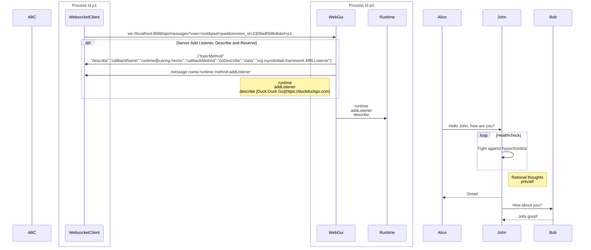

## Diagrams


```json
{
  "msgId": 1690145377501,
  "name": "runtime",
  "sender": "webgui@caring-hector",
  "sendingMethod": "",
  "historyList": [],
  "properties": null,
  "status": null,
  "encoding": "json",
  "method": "addListener",
  "data": [
    "{\"topicMethod\":\"describe\",\"callbackName\":\"runtime@caring-hector\",\"callbackMethod\":\"onDescribe\",\"class\":\"org.myrobotlab.framework.MRLListener\"}"
  ],
  "class": "org.myrobotlab.framework.Message"
}

```


