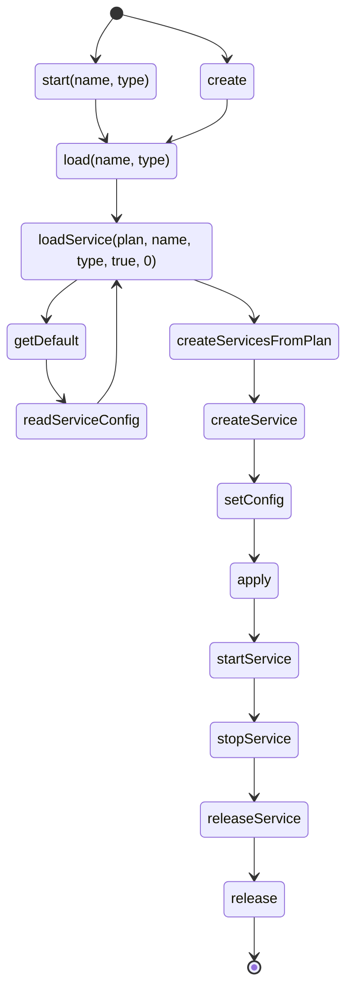

# Service Life Cycle

### start(name, type)
Creates and starts a service with the given name and type

### load
Starts loading the heirarchy of configuration
FIXME - this should not be the memory plan, but should exist on the filesystem
Default config is used if no config found ~~in memory~~ on filesystem

### loadService
Recursively loads a service config into a plan

### createServicesFromPlan(plan, createdServices, name)
Loops through all "loaded" services in the plan and creates them all

### createService
Instantiates instance of service

### setConfig
Sets the config of the service

### apply
Applies the config to the service